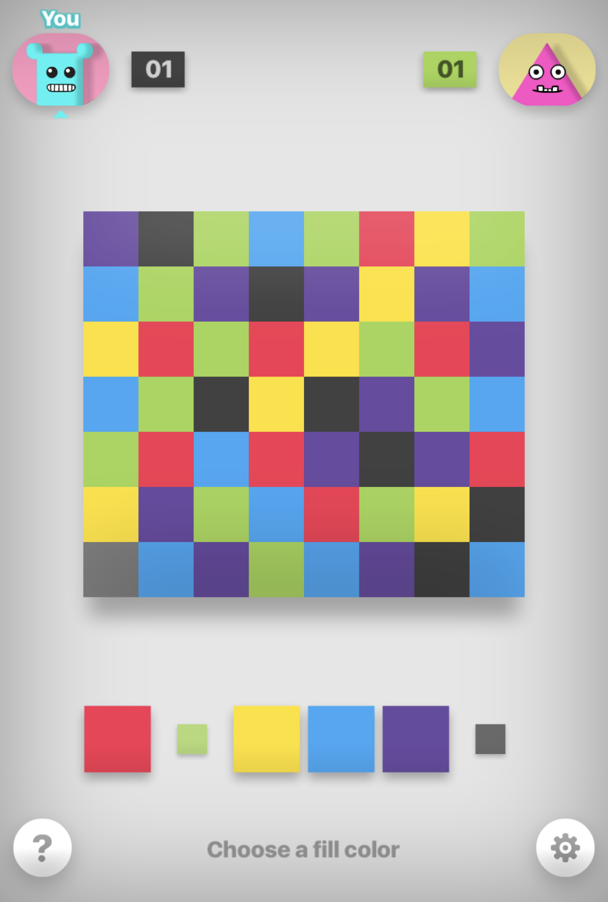
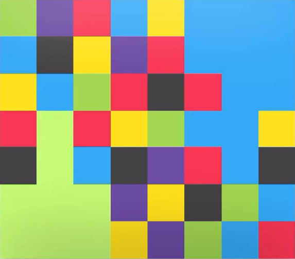

# Filler-AI

## Background

*Filler* is a 2-player game on the GamePigeon platform for iOS devices.  The game consists of a grid of colored tiles (red, green, blue, black, yellow, and purple), which are initially scrambled in such a way that no two adjacent tiles are the same color.

At the start of the game, each player has a single tile that belongs to their "region".  From each player's perspective, this tile is on the bottom left corner of their screen, because the game is mirrored when presented to each player.  However, for the purposes of designing this AI, and within this README, I'll refer to the filler board as if there is a Player "A" whose region starts at the bottom left of the grid, and a player "B" whose region starts at the top right corner of the grid.  In the example initial configuration shown above, you can see that Player A has a single black tile as its region, and Player B has a single green tile as its region.  

Each player takes turns selecting a new color for their region.  The player can select any of the 6 colors other than its own color, or its opponent's color.  Upon selecting a new color, all tiles of that color that were adjacent to the player's region previously are now absorbed into that player's region, *and* the player's entire region will change to that color.  The game will display a score for each player as the game progresses.  Each player's score is the number of tiles in that player's region.

Formally, the game ends when every tile on the grid is part of one of the two player's regions, but it's worth noting that once either player has a score of 29 or more, they are guaranteed to win the game because there are exactly 56 (28 times 2) tiles on the board, and there is no way for either player's region to get smaller as the game progresses.

Here is an example of what the grid may look like in the middle of the game.  Player A's region is green, and Player B's region is blue.

